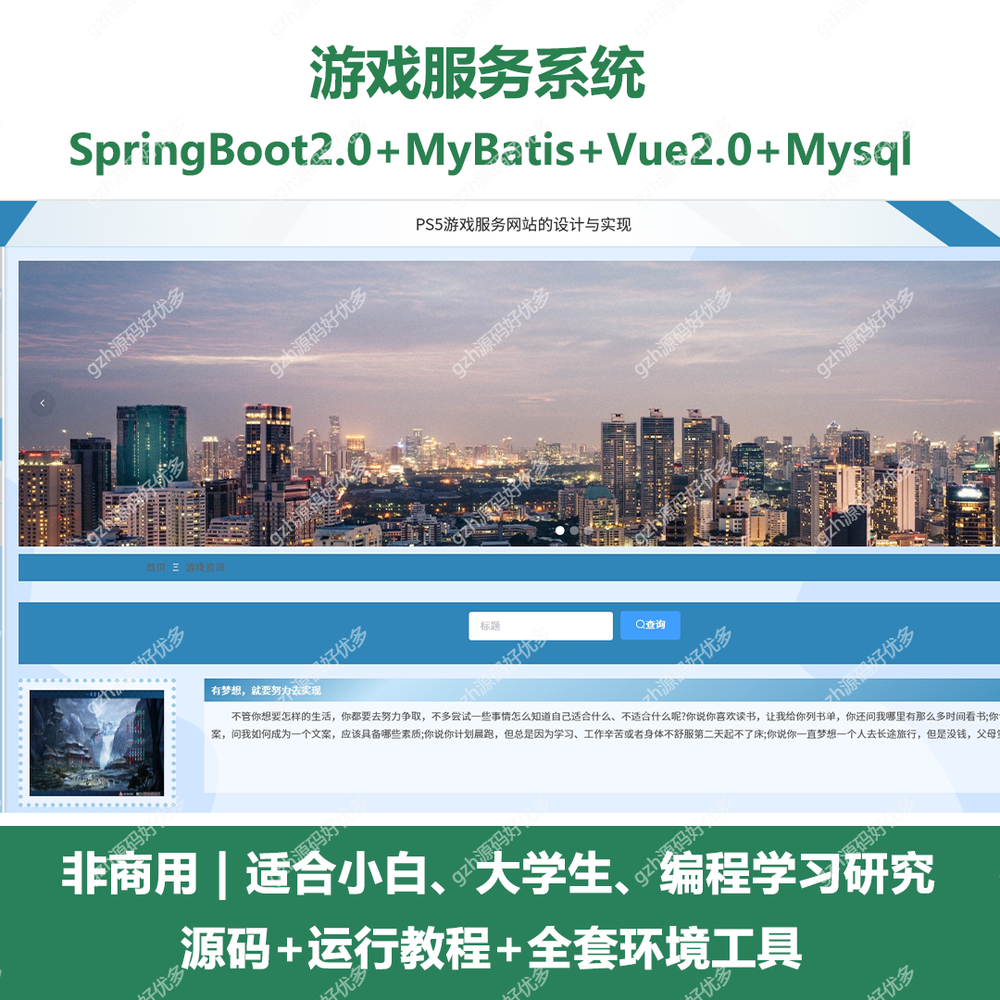
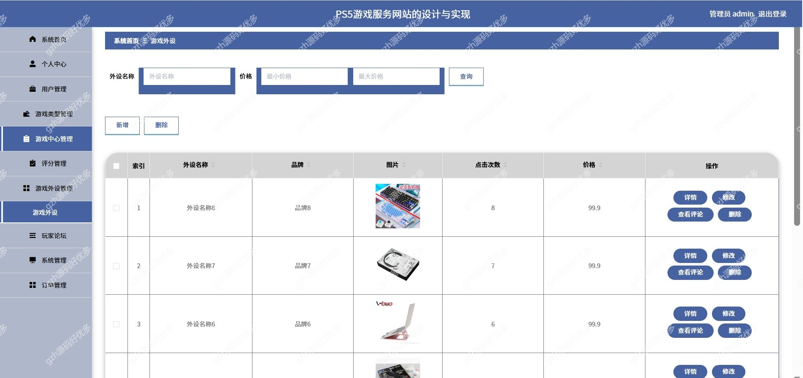
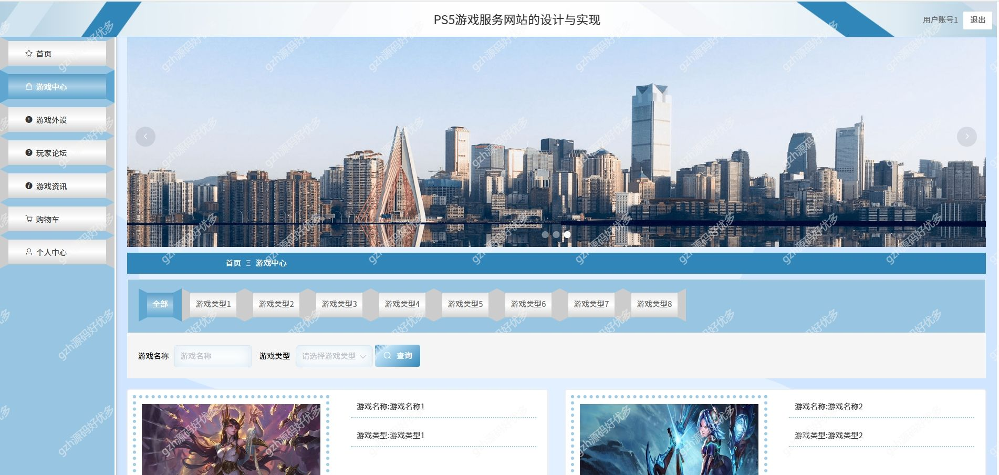
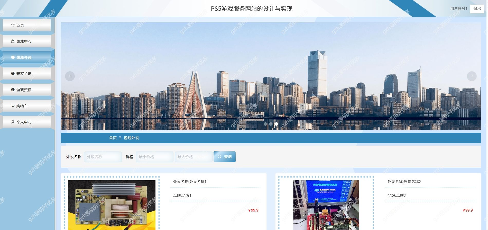
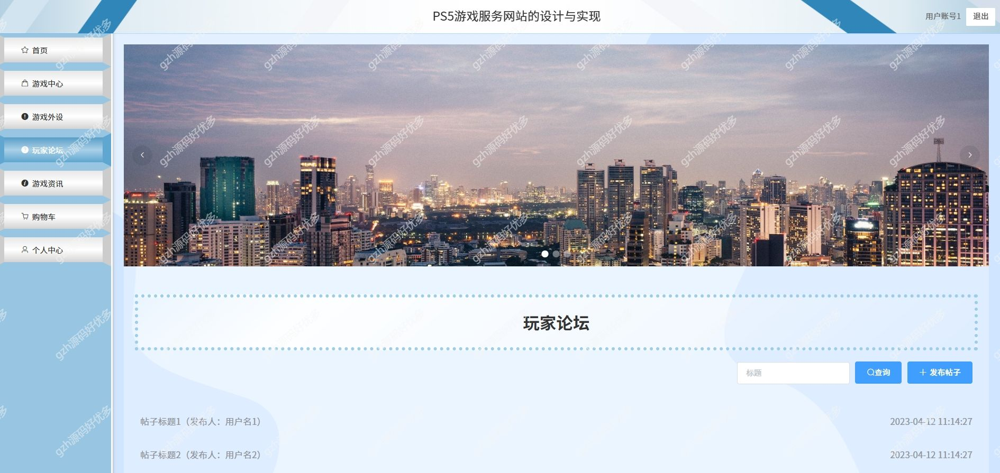
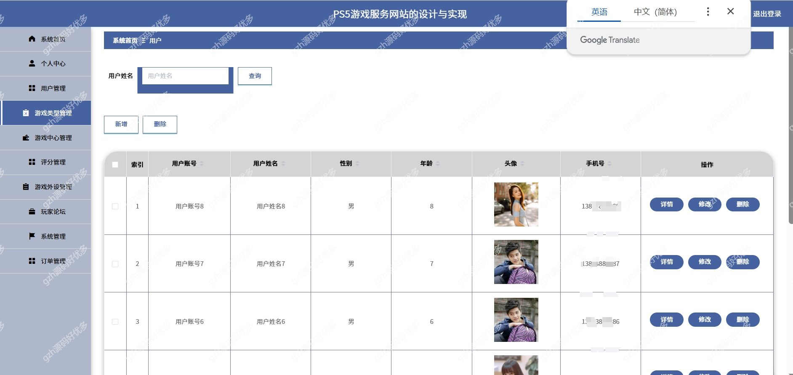
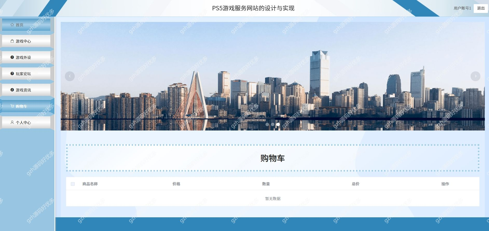
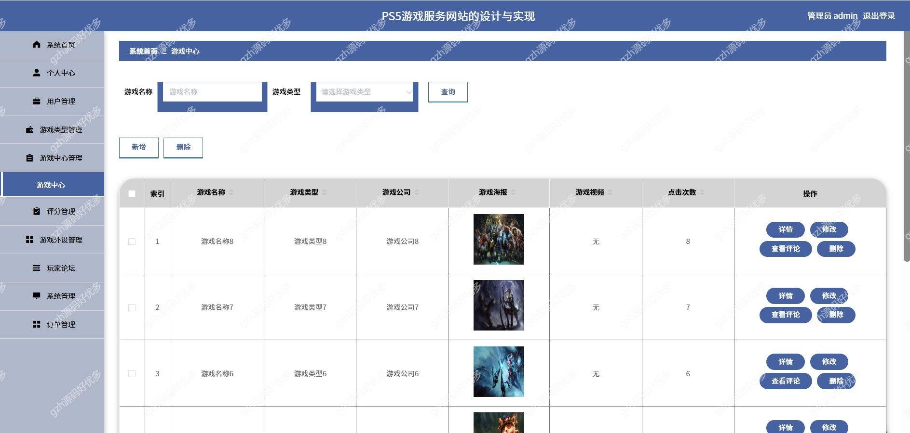
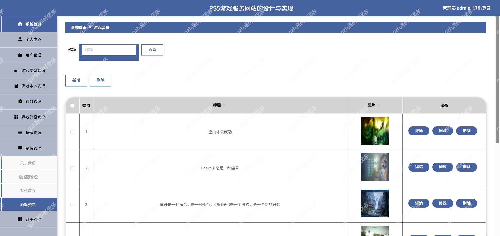

# springbootA322
springbootA322游戏服务网站
 
## 查看主页获取源码

### 一、关键词
游戏服务网站，游戏管理系统

### 二、作品包含
源码+数据库+全套环境和工具资源+本地部署教程

### 三、项目技术
前端技术：Html、Css、Js、Vue2.0、Element-ui 
后端技术：Java、SpringBoot2.0、MyBatis

### 四、运行环境（以下版本亲测，其他版本兼容性请自行测试）
开发工具：IDEA/eclipse  + VSCODE
数据库：MySQL5.7

数据库管理工具：Navicat10以上版本

环境配置软件： JDK1.8 + Maven3.6.3

前端Nodejs：14

浏览器：谷歌浏览器

### 五、项目介绍
项目编号：springbootA322

这是PS5游戏服务网站的用户管理后台界面，涵盖系统首页、个人中心等多模块，可对用户信息进行查询、增删改查操作，体现从基础用户数据管理向精细化、全流程平台运营支撑的功能拓展趋势 。

系统有，个人中心、用户管理（含用户信息查询、新增、删除、详情查看、修改）、游戏类型管理、游戏中心管理、评分管理、游戏外设管理、玩家论坛、系统管理、订单管理 ，可对用户等进行多维度运营管理。 

### 六、运行截图

